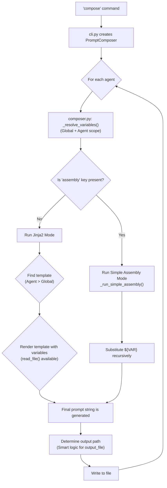

# Prompt Scribe: Software Architecture

## 1. Core Philosophy

Prompt Scribe is a declarative tool for composing complex prompts from modular parts. Its architecture is built upon three core principles:

1.  **Separation of Concerns:** The core logic (composition), user interface (CLI), and visual output (UI) are strictly decoupled. This allows for independent testing, maintenance, and evolution of each part.
2.  **Predictability over "Magic":** The final output of a prompt should be clearly and unambiguously derivable from the `prompts.yml` configuration. We avoid implicit behaviors and prefer explicit, declarative steps.
3.  **Configuration as the Primary API:** The `prompts.yml` file is the user's primary interface to the application's logic. All features are designed to be controlled through this file in an intuitive way.

## 2. Key Components (Modules)

The application is divided into three primary modules, each with a single, well-defined responsibility.

*   `promptscribe.cli`: **The Entrypoint.**
    *   **Responsibility:** Handles all command-line interactions, argument parsing (using Typer), and orchestrates the high-level workflow.
    *   **It MUST NOT contain any composition logic.** It only calls the `PromptComposer`.

*   `promptscribe.composer`: **The Engine.**
    *   **Responsibility:** Contains all business logic for loading configuration, resolving variables, and assembling the final prompt strings.
    *   **It MUST NOT produce any direct console output.** All user feedback (info, warnings, errors) is delegated to the `ui` module.

*   `promptscribe.ui`: **The Console Interface.**
    *   **Responsibility:** Provides a centralized, theme-based system for all console output (text, tables, progress bars). It ensures visual consistency and decouples the application logic from its presentation.

## 3. The Composition Lifecycle

This is the central process of the application. The following diagram and steps describe the exact flow for composing a single agent.

**Step-by-Step Flow:**

1.  **Initiation:** The `compose` command in `cli.py` instantiates the `PromptComposer`.
2.  **Variable Resolution:** For each agent, the composer first calculates the final variable dictionary by merging global variables with the agent's variables (`_resolve_variables`). Agent-specific variables always override global ones.
3.  **Mode Selection (The Central Fork):** The composer checks for the presence of the `assembly` key in the agent's configuration.
    *   **If `assembly` exists:** The **Simple Assembly Mode** is activated. The `_run_simple_assembly` method iterates through a list of explicit steps (`content`, `include`, etc.), building the prompt sequentially.
    *   **If `assembly` is absent:** The **Jinja2 Mode** is activated by default. The composer finds the appropriate template (agent-specific `template` key overrides the global `settings.template`) and renders it, passing the entire variable dictionary as context.
4.  **Recursive Substitution:** In both modes, any value containing a `${VAR}` placeholder is processed by the `_substitute_variables` function. This function recursively replaces variables with their values, including reading file content for variables that are paths. A depth limit prevents infinite loops.
5.  **Output Path Calculation:** The final output path is determined. If `output_file` is defined, it is used (as a full path or relative to `output_dir`). If not, a name is generated from the agent's key.
6.  **File Generation:** The composed prompt string is written to the calculated destination file.

## 4. Key Architectural Decisions & Rationale

This section documents the "why" behind critical design choices. Any future development must respect these decisions.

*   **Decision: Dual Composition Modes (`assembly` vs. `template`)**
    *   **Rationale:** To cater to two distinct use cases. **Simple Assembly** provides a straightforward, linear, and "what you see is what you get" experience for common scenarios. **Jinja2 Mode** provides maximum power and flexibility for complex prompts that require loops, conditionals, or advanced text manipulation. Making Jinja2 the default for agents without an `assembly` key simplifies configuration for power users.

*   **Decision: Recursive `${VAR}` Substitution**
    *   **Rationale:** To enable a fully declarative and DRY (Don't Repeat Yourself) configuration. Users can define a value once (like a file path) and reference it anywhere, including within other files. This is the core of the tool's flexibility.

*   **Decision: `read_file()` Function in Jinja2 Environment**
    *   **Rationale:** To make Jinja2 templates self-contained and more powerful. Instead of pre-loading file content in the composer, the template itself can decide which files to read based on its internal logic. This maintains the separation of concerns, keeping presentation logic inside the template.

*   **Decision: Strict Separation of `composer.py` and `ui.py`**
    *   **Rationale:** This is the most critical rule for project maintainability. The composition **engine** must be a pure, testable library that transforms data (YAML config) into a string. The **UI** is a presentation layer. This allows us to change the UI (e.g., to a web interface) without touching the core logic, and to unit-test the composition logic without mocking a terminal.

## 5. Guiding Principles for Future Development (The Genome)

1.  **Maintain the Separation of Concerns:** Never add `print()` or `ui.*` calls to `composer.py`. Never add composition logic to `cli.py` or `ui.py`.
2.  **Configuration Drives Features:** New features should primarily be exposed through additions to the `prompts.yml` schema. The implementation should be a direct reflection of the configuration.
3.  **Explicit is Better Than Implicit:** When adding new features, prefer clear, explicit configuration keys over behaviors that rely on conventions or "magic".
