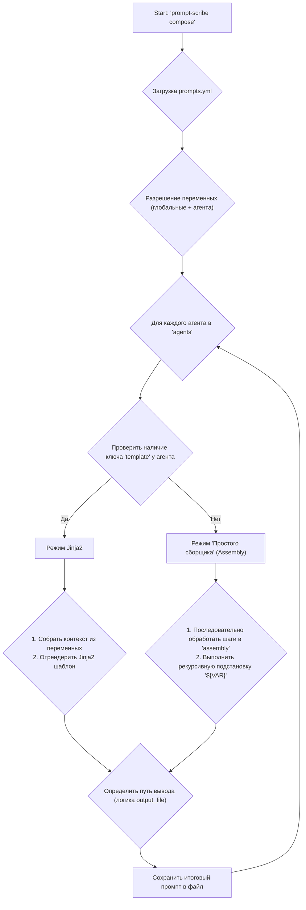

## План: Рефакторинг системы сборки промптов

### 1. Цели и задачи

Основная цель — сделать процесс создания и конфигурации промптов более гибким, интуитивно понятным и мощным. Мы отходим от жестко закодированной структуры в пользу декларативного подхода, основанного на переменных.

**Ключевые задачи:**
1.  **Внедрить систему переменных:** Глобальные и локальные (уровня агента) переменные с поддержкой переопределения.
2.  **Реализовать два режима сборки:**
    *   **"Простой сборщик" (`assembly`):** Для последовательной сборки из текстовых блоков, файлов и разделителей без использования шаблонизатора.
    *   **"Режим шаблонизатора" (`template`):** Сохранение поддержки Jinja2 для сложных сценариев.
3.  **Реализовать рекурсивную подстановку переменных:** Переменные `${VAR}` должны заменяться на свои значения как в конфиге, так и внутри подключаемых файлов.
4.  **Улучшить логику сохранения файлов:** Сделать поле `output_file` необязательным и добавить "умное" определение пути сохранения.
5.  **Упростить конфигурацию:** Удалить устаревшие и более не нужные поля из `settings`.
6.  **Обновить документацию и тесты:** Привести все сопутствующие артефакты в соответствие с новой логикой.

### 2. Новая структура конфигурационного файла (`prompts.yml`)

Это эталонный пример, демонстрирующий все новые возможности.

```yaml
# 1. Глобальные переменные, доступные всем агентам
variables:
  project_name: "DocuScribe"
  rules_path: "includes/development-rules.md"
  architecture_doc: "F:/Projects/docuscribe/.gemini/ARCHITECTURE.md"

# Глобальные настройки
settings:
  # output_dir остается единственной релевантной настройкой пути
  output_dir: "composed_prompts"

agents:
  # --- Пример 1: Использование "Простого сборщика" ---
  code-reviewer:
    # output_file не указан, будет сгенерирован как "code-reviewer.md"
    variables:
      # Переопределение глобальной переменной только для этого агента
      project_name: "Prompt Scribe"

    # Ключ 'assembly' активирует простой сборщик. Сборка идет последовательно.
    assembly:
      - content: |
          Ты — старший AI-разработчик для проекта `${project_name}`.
          Твоя главная задача — провести тщательный и конструктивный code review.

      - separator: "---"

      - h2: "📜 Ключевые правила разработки" # Явный хелпер для заголовка
      - include: rules_path # Вставка контента из файла по переменной

      - separator: "---"

      - h2: "📄 Архитектура проекта"
      - include: architecture_doc

  # --- Пример 2: Использование режима Jinja2 ---
  advanced-report-generator:
    template: "report.jinja2" # Ключ 'template' активирует режим Jinja2
    output_file: "../custom_outputs/final_report.txt" # Переопределение пути сохранения
    variables:
      report_type: "еженедельный"
      data_source: "includes/source-data.json" # jinja сможет работать с этой переменной
```

### 3. Высокоуровневая архитектура процесса

Диаграмма ниже иллюстрирует логику выбора движка сборки для каждого агента.



### 4. Детальный план реализации

#### Шаг 1: Рефакторинг загрузки конфигурации и разрешения переменных (модуль `composer.py`)

1.  **Класс `PromptComposer`:**
    *   В методе `_load_config` оставить только загрузку YAML в `self.config`.
    *   Создать новый внутренний метод `_resolve_variables(agent_name: str) -> dict`:
        *   Он должен сперва загружать глобальные переменные из `self.config.get('variables', {})`.
        *   Затем загружать переменные конкретного агента из `agent_config.get('variables', {})`.
        *   Объединять их, при этом переменные агента должны иметь приоритет.
        *   Возвращать итоговый словарь переменных.

#### Шаг 2: Реализация "Простого сборщика" (модуль `composer.py`)

1.  **Создать новый метод `_run_simple_assembly(agent_config: dict, variables: dict) -> str`:**
    *   Инициализировать пустой список `parts = []` для хранения частей промпта.
    *   Итерироваться по списку шагов в `agent_config['assembly']`.
    *   Для каждого шага использовать `match/case` или `if/elif` для определения типа действия (`content`, `include`, `separator`, `h1`-`h6`).
    *   **Логика `content`:**
        *   Взять текстовое значение.
        *   Пропустить его через функцию рекурсивной подстановки переменных (см. Шаг 3).
        *   Добавить результат в `parts`.
    *   **Логика `include`:**
        *   Получить имя переменной (например, `rules_path`).
        *   Взять из `variables` путь к файлу.
        *   Прочитать содержимое файла.
        *   Пропустить содержимое файла через функцию рекурсивной подстановки.
        *   Добавить результат в `parts`.
    *   **Логика `separator`:** Добавить значение (например, `"---"`) в `parts`.
    *   **Логика `h1`-`h6`:** Добавить отформатированную строку (например, `f"## {value}"`) в `parts`.
2.  **Сборка результата:**
    *   После цикла объединить все элементы из `parts` с помощью `"\n\n"` (двойной перенос строки для обеспечения одной пустой строки между блоками).
    *   Вернуть итоговую строку.

#### Шаг 3: Реализация рекурсивной подстановки переменных (модуль `composer.py` или новый `utils.py`)

1.  **Создать функцию `substitute_variables(text: str, variables: dict, depth: int = 0) -> str`:**
    *   Реализовать защиту от циклической зависимости: если `depth > MAX_DEPTH` (например, 10), выбросить исключение.
    *   Использовать `re.sub` с функцией-обработчиком для поиска всех вхождений `${VAR}`.
    *   **В функции-обработчике:**
        *   Извлечь имя переменной `VAR`.
        *   Если `VAR` есть в словаре `variables`:
            *   Получить значение.
            *   **Важно:** Если значение выглядит как путь к файлу (простая проверка), то рекурсивно вызвать `substitute_variables` для содержимого этого файла с `depth + 1`.
            *   Вернуть обработанное значение.
        *   Если `VAR` нет в словаре `variables`, вернуть пустую строку `''`.

#### Шаг 4: Обновление `compose_agent` и логики Jinja2 (модуль `composer.py`)

1.  **Переписать метод `compose_agent(self, agent_name: str)`:**
    *   Получить конфигурацию агента.
    *   Вызвать `_resolve_variables(agent_name)` для получения полного словаря переменных.
    *   **Проверить, есть ли ключ `template`:**
        *   **Если да (режим Jinja2):**
            *   Передать весь словарь `variables` в качестве контекста в `template.render()`. **Никакой сложной логики сборки контекста больше не нужно.**
        *   **Если нет (Простой сборщик):**
            *   Вызвать `_run_simple_assembly(agent_config, variables)` для получения готового промпта.
    *   **Реализовать новую логику `output_file`:**
        *   Определить путь для сохранения согласно правилам, которые мы обсудили (необязательное поле, генерация имени, определение абсолютного/относительного пути).
    *   Сохранить результат в файл.

#### Шаг 5: Обновление шаблона проекта и документации

1.  **Директория `src/promptscribe/project_template/`:**
    *   Полностью переписать `prompts.yml`, чтобы он соответствовал новой структуре (см. секцию 2 этого плана).
    *   Удалить из него `personas_dir`, `includes_dir`.
    *   Обновить `master.jinja2`, чтобы он работал с простым контекстом, а не со сложной структурой `persona` и `sections`.
2.  **Файл `README.md`:**
    *   Полностью переписать раздел "Configuration", объясняя новую систему с переменными и двумя режимами.
    *   Обновить примеры в разделе "Quick Start".

#### Шаг 6: Обновление тестов (директория `tests/`)

1.  Переписать существующие тесты для `PromptComposer`, чтобы они проверяли новую логику.
2.  Добавить новые тесты для:
    *   Корректного разрешения и переопределения переменных.
    *   Работы "Простого сборщика" со всеми типами шагов (`content`, `include` и т.д.).
    *   Корректной работы режима Jinja2 с новым форматом контекста.
    *   Всех сценариев логики `output_file`.
    *   Срабатывания защиты от циклических зависимостей.